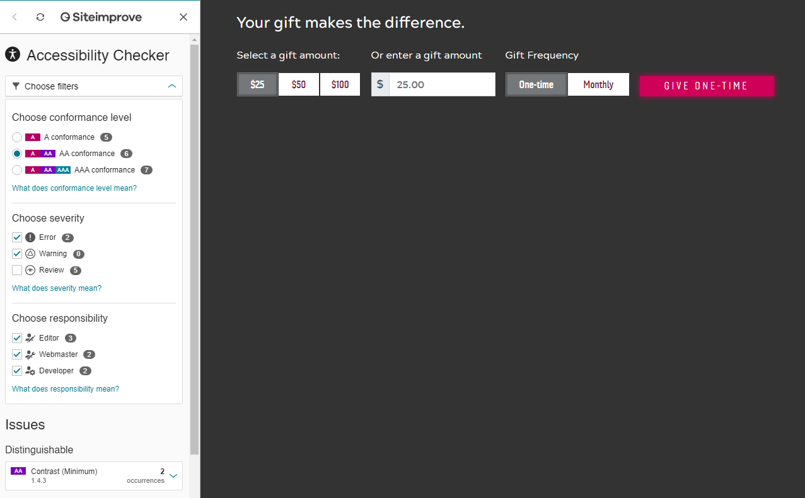
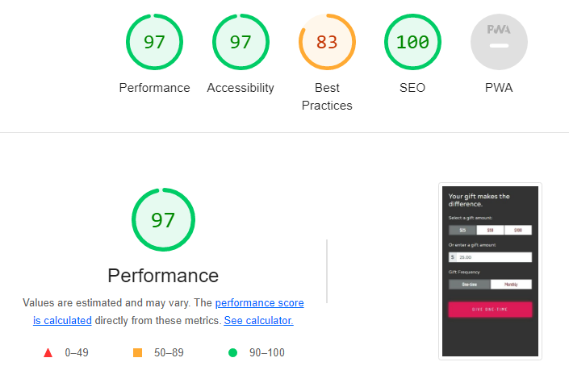

# Instructions
In order to have a discussion about your skills and approach to front-end development, we have outlined a small project for you to complete in advance of the second round interview. The goal of this assignment is to demonstrate how you would solve a development problem, showing your use of HMTL, CSS, and JavaScript / JQuery. 

The assignment is to recreate the attached comps from scratch. You can use the HTML file as a starting point, which links to the fonts, Bootstrap, and latest jQuery. The brand colors are available here: https://brand.vt.edu/identity/color/color-util.html

The requirements:

- must adhere to comp elements/layout
- must include all comp options and working features (all but actual submit action)
- must be responsive based on Bootstrap 4
- must use JavaScript, jQuery 3, or both to accomplish all functions
- must use brand fonts and colors (fonts linked into starting HTML file with BS4 and jQ3)
- must validate currency input field with $10,000 limit
- must display how a URL would change as options change via developer console, see "?option1=value&option2=value" or the like in console
- all code must be human readable, not minified

## Functionality 
User can select to donate a given amount ($25, $50, and $100) or they can also enter their own amount. If the user enters an amount but then decides they want to use a predetermined amount, the money amount they entered will be deleted

Once user is done typing/selecting their gift amount and frequency, the Give button will console.log the URL with the selected values appended to the URL
## Resources
- [Bootstrap 4](https://getbootstrap.com/docs/4.0/getting-started/introduction/)
- [Siteimprove](https://www.siteimprove.com/)
- [Google Lighthouse](https://developers.google.com/web/tools/lighthouse)
- [Virginia Tech Brand Color Tool](https://brand.vt.edu/identity/color/color-util.html)

## Accessibility Checks
### Siteimprove
 
#### Issue
Website was checked using Siteimprove Chrome extension. The scan showed that there was a contrast issue between the foreground and background of the labels. 

#### Solution
This can be fixed by making the text larger (between 19px-20px) or by making the text darker.

### Google Lighthouse
 

#### Issues
Just like Siteimprove, Lighthouse showed there was an issue with the contrast between the background and foreground of the labels. 

### NVDA Screen Reader
Website was tested using the NVDA screen reader to understand how it would behave for people with visual impairments